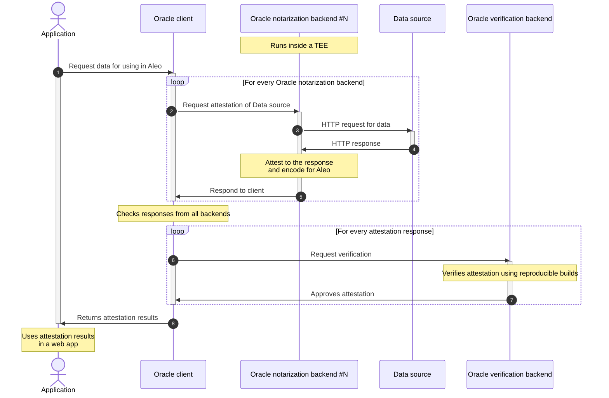
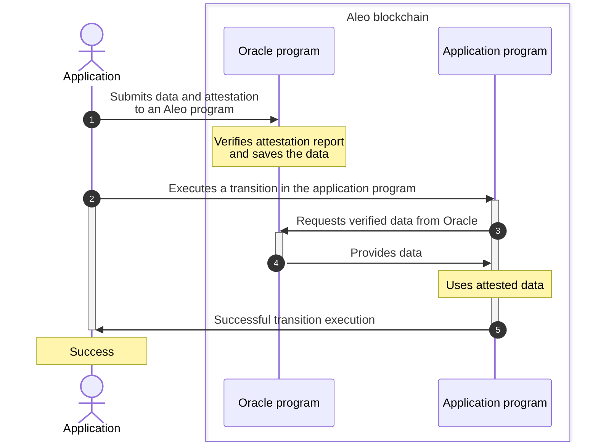

# Aleo Oracle architecture

On the high level, the Oracle architecture consists of:

- Oracle client
- one or more Oracle notarization backends running inside TEEs
- an Oracle verification backend
- Oracle Aleo program

## Architecture diagrams

The diagrams below show what happens when an application uses Oracle client to acquire and attest data,
then how the application uses the data in Aleo blockchain.

### Oracle client sequence diagram for acquiring and attesting data

### Aleo program sequence diagram after the client has acquired data

## Oracle client

The Oracle client is a dApp that needs to consume data from web2.0 in a secure way. This is most likeyly you - the developer!

By using one of the Oracle SDKs you can integrate the functionality of requesting web2.0 resources and using them in Aleo blockchain and your dApp.

Depending on the use case, you could use one of the deployed application-specific Oracle programs or develop your own.

The client is not required if all you need is to consume the data that has already been submitted to an existing Oracle program.

See [Using the Oracle](../guide/index.md) for tutorials on using the Oracle SDK and examples.

## Oracle backend

[Oracle backend repository :fontawesome-brands-github:]({{ variables.links.oracle_backend_repo }})

An Oracle backend receives a notarization request from a client. The request contains information about the web2.0 resource to notarize,
how to reach it, how to extract the relevant data from the resource and encode it for later usage.

The backend performs an HTTPS request to the specified resource, receives a response, then applies a selector to the response body, producing the relevant information in the resource.

The results are signed and attested by the TEE enclave.

## Oracle verification backend

[Oracle verification backend repository :fontawesome-brands-github:]({{ variables.links.verification_backend_repo }})

An Oracle verification backend received attested responses and verifies the attestation reports. One of the steps is verifying that the unique ID of the attesting enclave
matches the expected one. This is done using reproducible builds of the Oracle notarization backend.

This backend is also capable of decoding Aleo-encoded Report Data, decoding and verifying Aleo-encoded Attestation Reports, e.g. if you want
to verify someone else's reports/data.

You can self-host this backend by following [this Guide](../guide/hosting_verifier.md).

## Oracle program

An Aleo program that is capable of accepting Oracle attestation reports and attested data. See more information about how it works in the [Guide about the oracle program](../guide/oracle_program.md).
